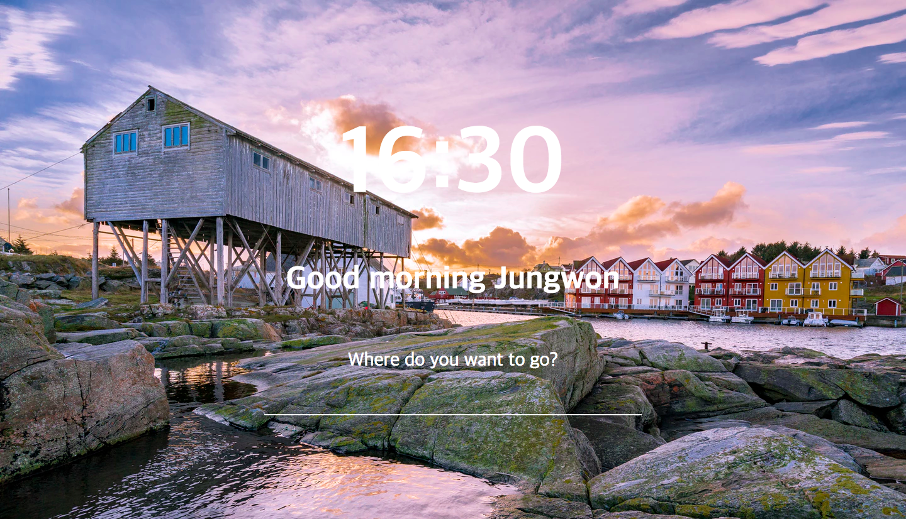

# 01-Week Assignment
  * HTML file code is provided, you just need to complete the css file.
## Keywords to google
  * Styling HTML form.
  * Background image overlay css

## Resources
  * div, h1, p, input[type="text"]
  * [image](https://images.unsplash.com/photo-1470260453955-6e918f763fc9?ixlib=rb-0.3.5&ixid=eyJhcHBfaWQiOjEyMDd9&s=3a8fc61922c89ff186f75be9c0f4cc9a&auto=format&fit=crop&w=1500&q=80)

## Screen-shot
  
  *Correct Result*
  
  *Wrong Result*
