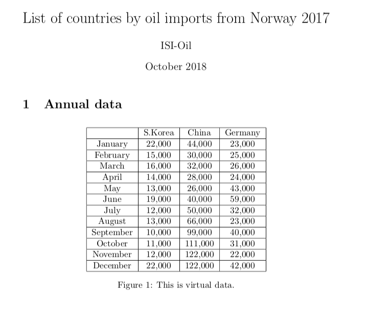
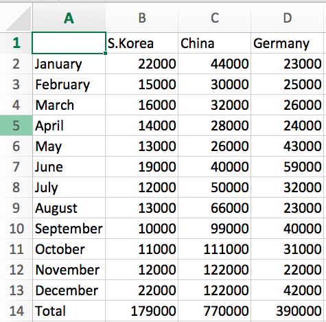

# 04-Week Assignment
  * Two Jupyter Notebook files are provided.
  * Write your own code on TODO part.
  * Try to make the same output that is already printed.
## Keywords to google
  * Sort dictionary, list in Python
  * Radian is weird in Python
  * How to read PDF in Python
  * How to write Excel in Python

## Resources
  * [Python Basic](python-basic.ipynb)
  * [Python Practical](python-practical.ipynb)
      * [Sample PDF file](sample_pdf.pdf)

## Screen-shot
  
  
